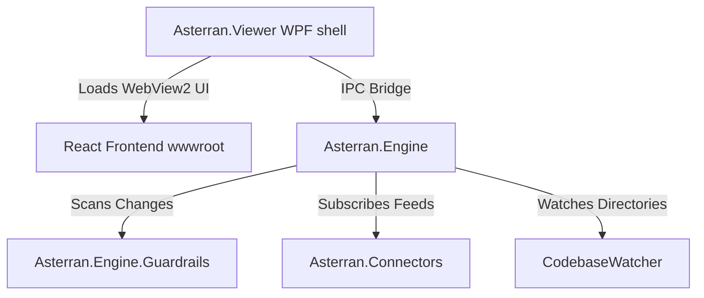

# Project Architecture

Asterran is structured into decoupled, modular assemblies to separate desktop rendering, core monitoring engine controllers, input connectors, and guardrail rules execution.

---

## 1. Assemblies and Layers

### Asterran.Viewer (WPF Desktop App)
Acts as the desktop shell holding a WebView2 control. It configures a virtual host mapping to serve assets from `wwwroot` and sets up an asynchronous IPC channel (`postMessage`) to bridge frontend interactions (like file selection and manual clearance clicks) to the core engine.

### wwwroot (React 18 Frontend)
A modular React single-page application split into functional components:
- **`Sidebar.js`**: Controls status, workspace path configuration, LLM connector selection (Gemini / Claude toggle), session ID binding, and task progress indicators.
- **`ArchitectureMap.js`**: Computes layout ranks and draws SVG UML diagrams.
- **`InspectionPanel.js`**: Consolidates Guardrails, File Lists, and Line Diffs into a tabbed layout.
- **`styles/`**: Component-scoped CSS stylesheets.

### Asterran.Engine (Core Controller)
The heart of the application. It coordinates:
- **`CodebaseWatcher.cs`**: Monitors workspace directories, debouncing filesystem inputs to filter noise. Ignores tool-generated directories (`.git`, `bin`, `obj`, `.vs`, `.gemini`, `.claude`, `node_modules`, etc.) and uses a 64KB internal event buffer to prevent event loss in active workspaces.
- **`ArchitectureAnalyzer.cs`**: Parses C# project file xml tags (`.csproj`) to build a dependency graph and resolve file status maps.
- **`TaskQueue.cs`**: Manages a background queue to execute tasks and report progress percentages to the UI.

### Asterran.Engine.Guardrails (Scanning Engine)
A decoupled scanning library with zero external dependencies. It defines:
- **`IGenericLexer`**: An interface for lexical regex tokenizers.
- **`IGuardrailRule`**: Scanners that match tokens against code violation criteria.
- **`GuardrailEngine`**: Evaluator orchestrator.

### Asterran.Connectors (Event Providers)
Implements connectors to hook into LLM transcript streams and raise events whenever actions or prompts occur. All connectors implement the `ILlmConnector` interface (`Start`, `Stop`, `OnActivity`):
- **`AntigravityTranscriptConnector`**: Tails Google Gemini (Antigravity) JSONL session logs under `~/.gemini/`.
- **`ClaudeTranscriptConnector`**: Tails Claude Code JSONL session transcripts under `~/.claude/projects/`, parsing tool-use blocks (`Bash`, `Write`, `Edit`, `Read`) into activity events.

---

## 2. IPC Communication Schema

Frontend to Backend commands and Backend to Frontend update event patterns are sent as JSON payloads:

### Frontend to Backend:
- `init`: Triggers config synchronization on page load.
- `start` / `stop`: Controls watcher state toggles.
- `selectWorkspace`: Opens a folder picker dialog.
- `setConversationId`: Binds to a specific session log file (blank = auto-detect latest).
- `setConnectorType`: Switches the active LLM connector (`"gemini"` or `"claude"`); resets the session ID and reinitializes the engine.
- `clearViolation`: Manually acknowledges and removes an active guardrail flag.

### Backend to Frontend:
- `config`: Sends current workspace path, conversation ID, connector type, and running state. Emitted on `init`, workspace change, and connector type change.
- `engineStatus`: Broadcasts monitoring running state changes.
- `activity`: Streams LLM prompt, thought, and action timeline entries.
- `fileChange`: Dispatches file path, change type, line counts, and full LCS diff data.
- `taskQueue`: Synchronizes background task names and progress percentages.
- `architecture`: Transmits resolved project nodes and active violations lists.
